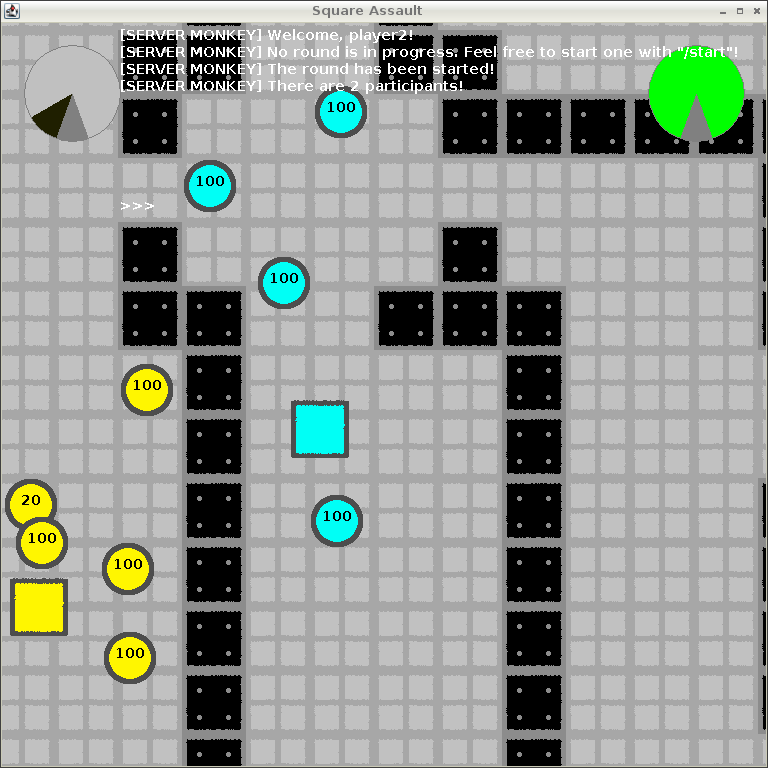

# Square Assault: Project for CodeDay in Spring 2015

Play a game of multiplayer tower defense!

## Joining the game

[Download the game client](https://github.com/col6y/code-day-spring-2015/releases/download/v0.1.6/Client.jar) and launch it. Enter a username to represent you.

Note that you need a second player to join for the game to run! Once there are at least two players, you can type "/start<ENTER>" and the game will start. You won't be able to move around until the game starts.

## Interpreting the screen

 * The meter in the upper-left corner is the number of towers you are ready to place.
 * The meter in the upper-right corner is your health. Don't let it drop to zero, or you're out!
 * You are highlighted in cyan, and your enemies are highlighted in yellow.
 * Players are squares, and towers are circles.
 * The number on each tower is its percentage of structural integrity. When it hits zero, it is destroyed!

## Controls

 * Use arrow keys to move.
 * Click to place a tower, if you have any ready for placement.
 * Type to chat, and press enter to send.

## Gameplay notes

 * You will get new turrets on a regular basis.
 * Turrets will automatically fire at the closest enemy.
 * You will block the bullets of your own turrets if you stand in their way!
 * Players and turrets will lose health each time they are shot. Multiple bullets mean more damage!
 * Don't blow your entire arsenal at once! Save some turrets for when you really need them.
 * Think carefully about where you place your towers. Terrain matters!

## History

This project was created on the Spring 2015 CodeDay as an individual project after the rest of my original team abandoned the event part way through for unknown reasons.

I scraped together what was left - which was all code that I had written - and developed it into this game!

It won "Best Individual Project" and a surprising number of other attendees found it fun to play!
